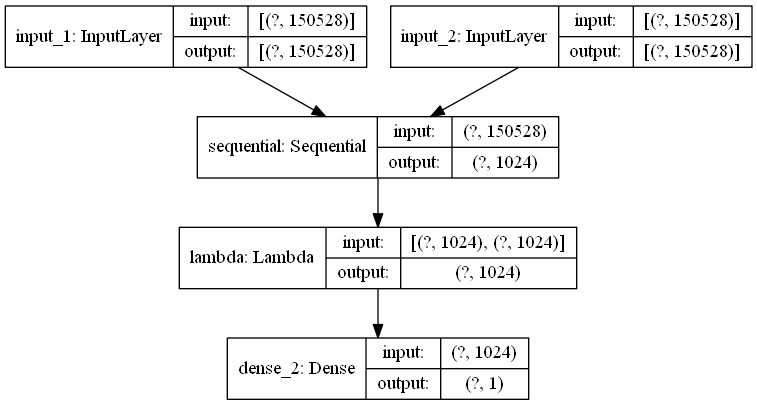

# Palm Recognition using Siamese Network

Amazon is going to commercialise [Amazon One](https://www.theverge.com/2020/9/29/21493094/amazon-one-palm-recognition-hand-payments-amazon-go-store), which is a technology for identifying individuals from their palms. This is similar to the [Kaggle Humpback Whale Identification challenge](https://www.kaggle.com/c/humpback-whale-identification) as well as the [Kaggle Landmark Recognition challenge](https://www.kaggle.com/c/landmark-recognition-2020). The goal of this project is to build a pipeline which allows doing one-shot learning.

## Data

## Implementation
execute cells in `palm-recognition.ipynb` 
Keras
mention [Fingerprint Recognition](https://github.com/utsav-195/fingerprint-recognition-using-siamese-network-with-retraining)

## Results
